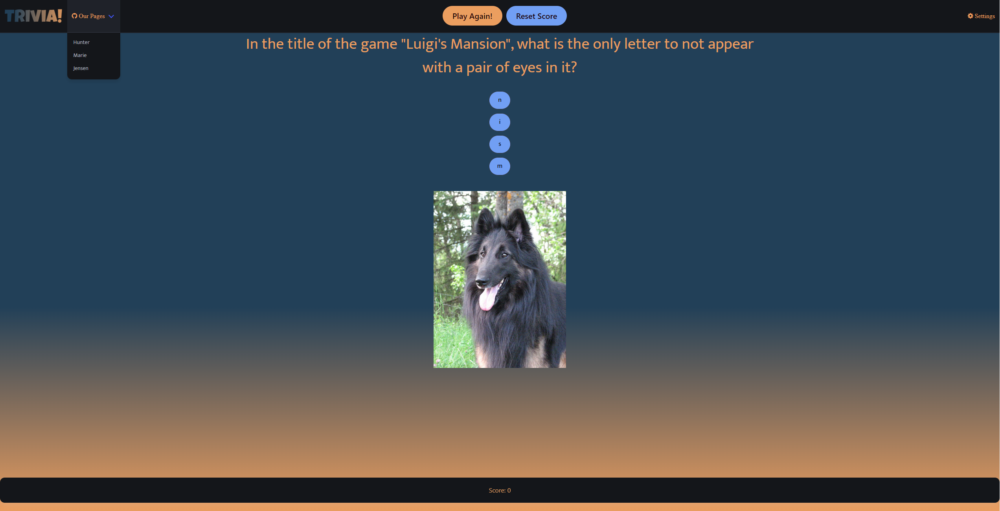
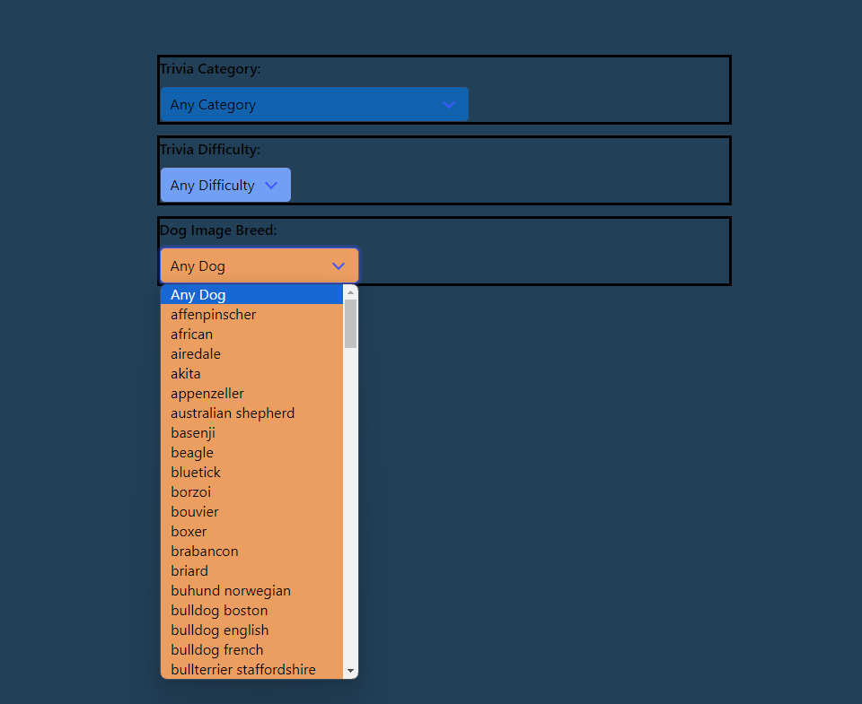

# Group Trivia Website for Project 1
In this project, we (Hunter, Jensen, and Marie) have created an interactive webpage for playing a trivia game!
It requests a trivia question from [The Open Trivia Database](https://opentdb.com/) and a dog image from [Dog Api](https://dog.ceo/dog-api/), both of which can be changed in our settings modal! You can choose what types of questions get asked, the difficulty of them, and the type of dog images you're seeing!
It also keeps score of your answered questions, and can be reset should you want to start over.

## Project Requirements
You and your group will use everything you’ve learned over the past six modules to create a real-world front-end application that you’ll be able to showcase to potential employers. The user story and acceptance criteria will depend on the project that you create, but your project must fulfil the following requirements:

- Use a CSS framework other than Bootstrap.
- Be deployed to GitHub Pages.
- Be interactive (i.e: accept and respond to user input).
- Use at least two server-side APIs.
- Include at least one modal, and does not use native browser alert, confirm, or prompt functionality.
- Use client-side storage to store persistent data.
- Be responsive.
- Have a polished UI.
- Have a clean repository that meets quality coding standards (file structure, naming conventions, follows best practices for class/id-naming conventions, indentation, quality comments, etc.).
- Have a quality README (with unique name, description, technologies used, screenshot, and link to deployed application).

## Deployed Web App
You can find the deployed web page for this project [here!](https://lockedjce.github.io/Group-Trivia-Website/)

## Credits
[LockedJCE](https://github.com/LockedJCE) - HTML, CSS, Bulma
[DeceitfulDragon](https://github.com/DeceitfulDragon) - JavaScript, JQuery
[mariedevoll](https://github.com/mariedevoll) - HTML, CSS, Bulma

